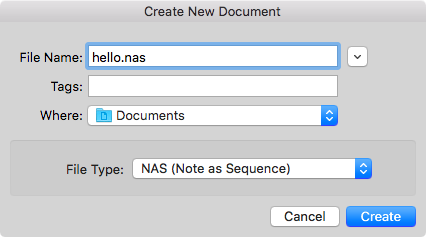
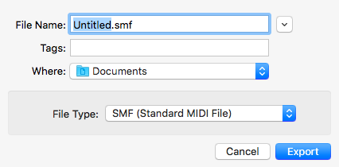
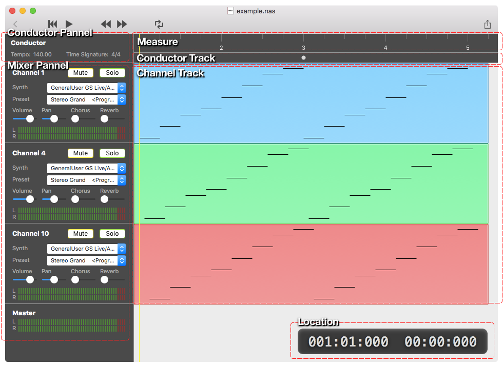
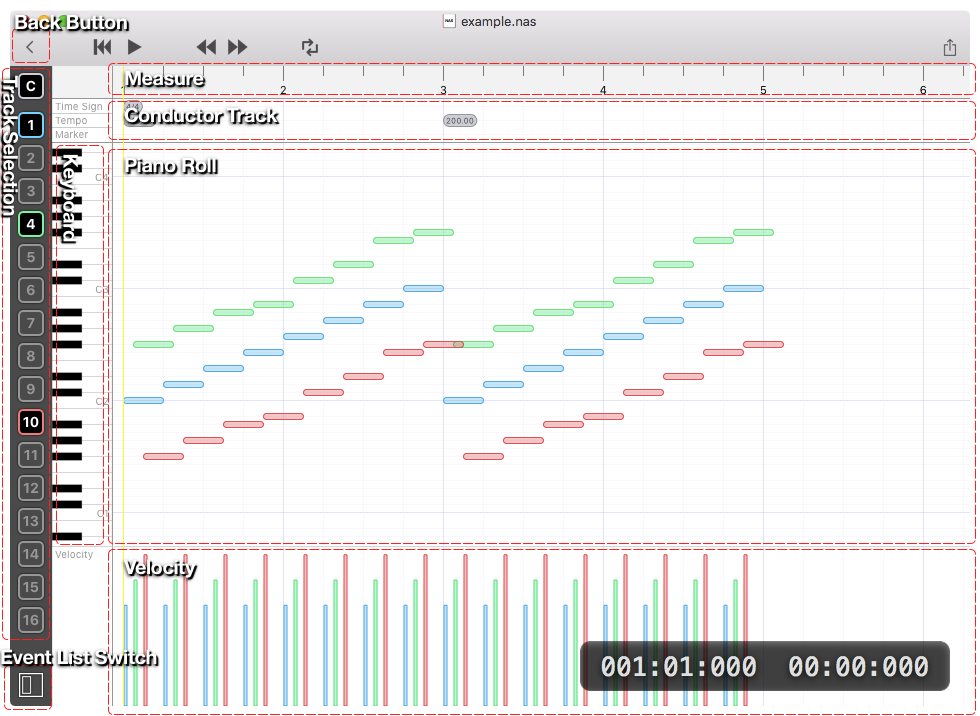
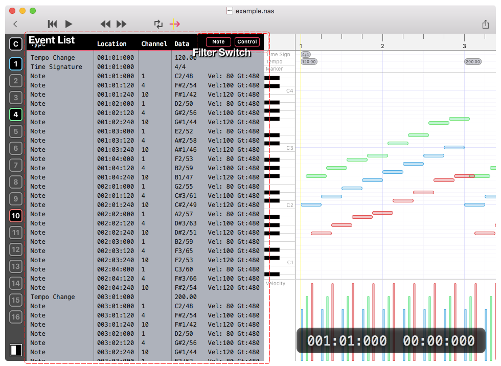

Operation Manual General
========================

File
----
### Create New File
0. Open File Creation Dialog  
    Choose \[File\] -> [New] from menu.

0. Select File Type  
    Select file type in File Creation Dialog.  
    Following file types are available

    - Note as Sequence (.nas)
    - ABC Notation (.abc)
    - Music Macro Language (.mml)

    

0. Enter File Name and Click \[Create\] button

**Shortcut Key**  
⌘ + N

### Open Existing File
Choose \[File\] -> \[Open...\] from menu.

**Shortcut Key**  
⌘ + O

### Open In Editor
Choose \[File\] -> \[Open In Editor\] from menu.

**Note:**  
This menu is only available when document window is opened.
Additionally, behavior is different when editor window is selected.
See below for the detail.

#### In Document Window
Open source file in editor window.
If external editor is selected in [Preferences](TODO), external editor will be launched and open source file.

#### In Embedded Editor
File Open Dialog will be shown.
After selection, open the selected file in editor window.

**Shortcut Key**  
⌘ + E

### Save Document
Choose \[File\] -> [Save...] or [Save As] from menu.
These menus are only available in editor window.

**Shortcut Key**  

- ⌘ + S
- ⌘ + Shift + S (Save with different file name)

### Export
_**Full Version Feature**_

0. Choose \[File\] -> \[Export...\] from menu or click toolbar button in document window.

    

0. Select file type in expoting sheet.
    Following file types are available

    - Standard MIDI File (Format 1)
    - Waveform Audio File Format (WAV 44.1kHz Linear PCM 16bit stereo)
    - Advanced Audio Coding (AAC 44.1kHz 192kbps stereo)

    

0. Enter File Name and Click \[Export\] button

**Shortcut Key**  
⌘ + Shift + E

Playback Control
----------------
### Play/Pause
Play sequence in current document window.

Choose \[Control\] -> \[Play/Pause\] from menu or click toolbar button in document window.


**Shortcut Key**  
⌘ + P

### Rewind
Rewind playing location to beginning of sequence.

Choose \[Control\] -> \[Rewind\] from menu or click toolbar button in document window.


**Shortcut Key**  
⌘ + R

### Forward
Forward playing location to beginning of next measure.

Choose \[Control\] -> \[Forward\] from menu or click toolbar button in document window.


**Shortcut Key**  
⌘ + F

### Backward
Backward playing location to beginning of previous measure.

Choose \[Control\] -> \[Backward\] from menu or click toolbar button in document window.


**Shortcut Key**  
⌘ + B

### Toggle Repeat
Change repeat state in a cycle.
Repeat Off -> Repeat All -> Repeat Marker -> Repeat Off ...

Choose \[Control\] -> \[Toggle Repeat\] from menu or click toolbar button in document window.


**Shortcut Key**  
⌘ + Shift + R

#### Repeat State
##### Repeat Off


Stop playback when playing location reach to end of sequence.

##### Repeat All


Play again from beginning of sequence when playing location reach to end of sequence.

##### Repeat Marker


Play again from beginning of section when playing location reach to end of section.
Section is divided by [Marker Event](TODO).
For example, if sequence events are
```
001:01:000 C2 Gatetime=1920
002:01:000 Marker A
002:01:000 D2 Gatetime=1920
003:01:000 Marker B
003:01:000 E2 Gatetime=1920
004:01:000 F2 Gatetime=1920
```
sections will be listed below.
```
   | 1               2               3               4               5
========================================================================
   | S               A               B               .               E
------------------------------------------------------------------------
   | .               .               .               x---------------.
   | .               .               x---------------.               .
   | .               .               .               .               .
   | .               x---------------.               .               .
   | .               .               .               .               .
C2 | x---------------.               .               .               .

     |<-- section -->|<-- section -->|<---------- section ---------->|

S = beginning of sequence
E = end of sequence
```


Views
-----
### Main View


#### Conductor Panel
##### Tempo
Display tempo value on current location.

##### Time Signature
Display tempo value on current location.

#### Mixer Panel


##### Channel
Display channel number.

##### Mute
Button to toggle mute on/off.

##### Solo
Button to toggle solo on/off.

##### Synth
Pull-down menu to select synthesizer.

_If there is control event in sequence, player will change synthesizer and pull-down selection will be updated._

##### Preset Pull-Down
Pull-down menu to select preset in synthesizer.

_If there is control event in sequence, player will send the event to synthesizer and pull-down selection will be updated._

##### Volume / Pan / Chorus / Reverb
Slidiers for each synthesis value.

_If there is control event in sequence, player will send the event to synthesizer and slider position will be updated._

##### Level Indicator
Display output level for each channel.

#### Measure
- Display guide for measure and beat
- Seek current location to clicked position with click

#### Conductor Track
- Display events below.
    - [Tempo Change](TODO)
    - [Time Signature](TODO)
    - [Marker](TODO)
- Select track with click
- Show detail view with click after selection

#### Channel Track
- Display [Note](TODO) events
- Select track with click
- Show detail view with click after selection

**Tips**  
You can select multiple track with ⌘ + click or Shift + click  
Additionally, following shortcut key is available.

- ⌘ + A for select all tracks (including conductor track)
- ESC for deselct all tracks

#### Location
Display current location. location format is listed below from left side.

- \<measure number>:\<beat>:\<tick>
- \<minutes>:\<seconds>:\<milli seconds>

### Detail View


#### Back Button
Button for back to main view.

#### Track Selection
Button to toggle display for events in track.

##### Selection State


#### Measure
Behavior is same as main-view.

- Display guide for measure and beat
- Seek current location to clicked position with click

#### Conductor Track
Display events below.

- [Tempo Change](TODO)
- [Time Signature](TODO)
- [Marker](TODO)

#### Piano Roll
Display [Note](TODO) events in selected channel tracks.

#### Keyboard
- Guide for scale
- Preview sound on selected channel track with click

#### Velocity
Display velocity of [Note](TODO) events in selected channel track.

#### Event List Switch
Button to toggle display event list.

#### Event List
Display events in selected tracks



##### Filter Switch
###### Note
Button to toggle display note events.

###### Control
Button to toggle display events except note event.

### Error Window
If there is syntax or grammer error in source file, error window shows up.
Errow window can be manually hidden by [x] button. Also, it is automatically hidden after error is corrected and source file is saved.


