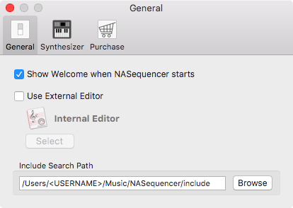
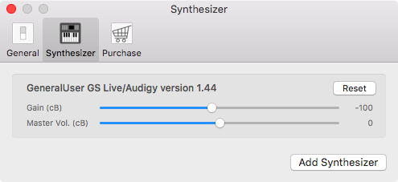
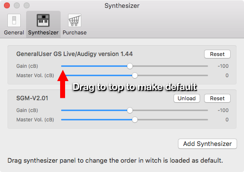

Operation Manual Preference
===========================

General Settings
----------------


### Show Welcome on Launch
Checkbox to toggle show Welcome Window on Launch Application.

### External Editor
#### Change Editor
0. Check the "Use External Editor" checkbox
0. Click "Select" Button
0. Choose prefer app on selection dialog

If you want to reset to using Inteneal Editor, uncheck the "Use External Editor" checkbox.

### Include Search Path
This path is used by [Include Directive](TODO).
If the path ponts to default "/Users/\<USERNAME\>/Music/NASequencer" and Include Directive is notated on source file like below,
```
#include "drums-pattern.nas"
```
"/Users/\<USERNAME\>/Music/NASequencer/drums-pattern.nas" is read.

#### Change Include Search Path
0. Click "Browse" Button
0. Choose prefer directory on selection dialog

Synthesizer Settings
--------------------


### Level Adjustment
Used for balancing output level of each synthesizer. Unit of both gain and master volume is centibel. (1/10 of dB)

#### Reset
Button to reset level adjustment.

### Adding Synthesizer
_**Full Version Feature**_

0. Click "Add Synthesizer" Button
0. Choose prefer SoundFont on selection dialog

#### Change Default Synthesizer
Order of synthesizer panel affects to the order of [Synth](./operation-manual-general.md#synth) pull-down menu.
First synthesizer of the order is the default synthesizer used for default sound.


Purchase
--------
### Purchase Full Version
Click "Purchase" button to purchase from App Store and unlock full version features.
Your purchase will help NASequencer’s development. Thank you!

#### Full Version Features
- Adding Synthesizer

    Loading additional synthesizer with SoundFont file. (.sf2 format)

- Exporting to SMF/WAV/AAC
    Exporting your sequence data to

    - Standard MIDI File (Format 1)
    - Waveform Audio File Format (WAV 44.1kHz Linear PCM 16bit stereo)
    - Advanced Audio Coding (AAC 44.1kHz 192kbps stereo)

### Restore Purchase
If you already purchase full version and you have not activate your new Mac yet, Click "Restore Purchase" button and unlock full version features.
You don't have to purchase again.
