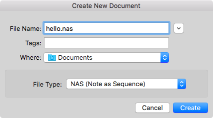

Getting Started
===============

Create New File
---------------
At the beginning, you need to create an empty file.

- Create empty file from menu [File] -> [New]
- In file creation dialog, choose file type with Note as Sequence(.nas)
- Enter file name with "hello.nas" or something
- Click [Create] Button



After file creation, editor window and document window appear.
Then, NASequencer starts to watch file changes.

**Tips**  
You can change default text-editor to other application from [Preferences - External Editor](preference.md#External Editor).

Hello NASequencer
-----------------

### hello.nas
```
480: C2
480: D2
480: E2
480: F2
```

The first example is that's it!  
Type above snippet in editor-window.
Then save it.

Now, you can see the sequence in document window.
The sequence will be like following list.

```
   | 1               2
========================
   | .           x---.  
   | .       x---    .  
   | .               .  
   | .   x---        .  
   | .               .  
C2 | x---            . 
```

Then, press play button on toolbar (or short-cut ⌘P key) to play sequence.
You can hear melody of 'C D E F'.

### Modify sequence

Let's edit "hello.nas" with NASequencer is stayed running.

```
480: C2
480: D2
480: E2
480: F2
-------------
480: G2
480: A2
480: B2
480: C3 E3 G3
```

Adding 3 notes and 1 chord up to 1 octave.
Then save it.

Anytime you save file, NASequencer automatically reflects music sequence in document window.
Now, you can see the sequence like following list.

```
   | 1               2               3
========================================
   | .               .           x---.
   | .               .               .
   | .               .               .
   | .               .           x---.
   | .               .               .
   | .               .               .
   | .               .               .
C3 | .               .           x---.
   | .               .       x---    .
   | .               .               .
   | .               .   x---        .
   | .               .               .
   | .               x---            .
   | .               .               .
   | .           x---.               .
   | .       x---    .               .
   | .               .               .
   | .   x---        .               .
   | .               .               .
C2 | x---            .               .  
```

Then, play it and you can hear melody of 'C D E F G A B C/E/G'.

Check the Basic Structure
-------------------------

#### hello.nas
```
480: C2 // Steps and Note
480: D2
480: E2
480: F2
------------- // Comment
480: G2
480: A2
480: B2
480: C3 E3 G3
```

### File Extention
The file extention ".nas" means that file is "Note as Sequence" format.

### Steps
In "Note as Sequence", `480:` means 'Step'.
Step specifies how many ticks the sequence is forwarded.
Gatetime, that is duration of notes, is also decided by step.

The defalut ticks per a measure on 4/4 beat is 1920.
480 means quarter note length.

**Tips**  
You can change config of ticks per quarter note by [RESOLUTION](note-as-sequence.md#RESOLUTION) statement.
However in most of cases, it's unnecessary to change it because 480 is the defact standard of division used by many DAW.

### Note
`C2` means C note with octave 2.  Valid note range is C-2 to G8.

**Tips**  

- `#` is for the sharp, `b` is for the flat and `n` is for natural
- Double sharp and double flat is acceptable
- Natural is only affected when [KEY](note-as-sequence.md#KEY) is specified

### Comment
`==` `--` `//` can be used the line comment. It does not affect the result of sequence.
`/* */` is also available for multiple line comments.
`==` and `--` are expected to used for readability.

Next Step
---------
### Listen to example
Show welcom window by menu [Window] -> [Welcome to NASequencer].
Choose "Listen to example" from the window.
Then, figure out composition of music syntax.

**Tips**  
You can edit example and preview result.
When you want to reset it, reopen example from welcome window.

### Check Syntax Reference
Documented about syntax in this section is just for introduction. Please check the references.

- [Note as Sequence](note-as-sequence.md)

### Other Languages
NASequencer suports following languages.

- [ABC Notation](abc-notation.md)
- [Music Macro Language](music-macro-language.md)

If you familiar with those. you can choose format from file creation dialog.

### Advanced Usage
When you are familiar with basics, read [Operation Manual](operation-manual.md) for more advanced usage.
